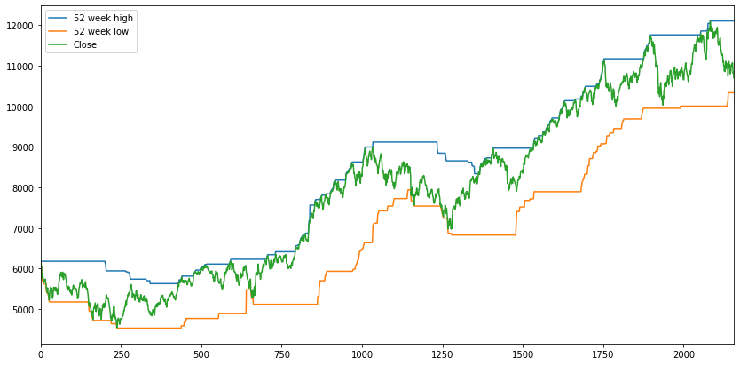

## Inteligent Systematic Investments.

### Evaluations of Manoj Kumar Jain's [Fixed-Fixed-Double Strategies](https://www.youtube.com/watch?v=kcHLgN8jUZ8)

```python
import glob
import sys
import os
import pandas as pd
import matplotlib.pyplot as plt
from datetime import datetime
plt.rcParams['figure.figsize'] = [14, 7]
```


```python
# Config options
cwd = 'data'
```


```python
dateparse = lambda x: pd.datetime.strptime(x, '%d-%b-%Y')
nifty = pd.concat([pd.read_csv(cwd + '/' + f, parse_dates=['Date'], date_parser=dateparse) for f in sorted(os.listdir(cwd))], ignore_index = True)
```


```python
nifty.describe()
```


<div>
<style scoped>
    .dataframe tbody tr th:only-of-type {
        vertical-align: middle;
    }

    .dataframe tbody tr th {
        vertical-align: top;
    }

    .dataframe thead th {
        text-align: right;
    }
</style>
<table border="1" class="dataframe">
  <thead>
    <tr style="text-align: right;">
      <th></th>
      <th>Open</th>
      <th>High</th>
      <th>Low</th>
      <th>Close</th>
      <th>Shares Traded</th>
      <th>Turnover (Rs. Cr)</th>
    </tr>
  </thead>
  <tbody>
    <tr>
      <td>count</td>
      <td>4903.000000</td>
      <td>4903.000000</td>
      <td>4903.000000</td>
      <td>4903.000000</td>
      <td>4.903000e+03</td>
      <td>4903.000000</td>
    </tr>
    <tr>
      <td>mean</td>
      <td>5028.744983</td>
      <td>5062.516990</td>
      <td>4989.049154</td>
      <td>5026.400959</td>
      <td>1.498470e+08</td>
      <td>6290.407073</td>
    </tr>
    <tr>
      <td>std</td>
      <td>3138.698027</td>
      <td>3146.534063</td>
      <td>3123.482854</td>
      <td>3134.811321</td>
      <td>9.859852e+07</td>
      <td>4425.010146</td>
    </tr>
    <tr>
      <td>min</td>
      <td>853.000000</td>
      <td>877.000000</td>
      <td>849.950000</td>
      <td>854.200000</td>
      <td>1.394931e+06</td>
      <td>40.120000</td>
    </tr>
    <tr>
      <td>25%</td>
      <td>1919.050000</td>
      <td>1942.400000</td>
      <td>1901.650000</td>
      <td>1918.425000</td>
      <td>7.620246e+07</td>
      <td>2958.745000</td>
    </tr>
    <tr>
      <td>50%</td>
      <td>5005.350000</td>
      <td>5057.500000</td>
      <td>4956.450000</td>
      <td>5003.950000</td>
      <td>1.345816e+08</td>
      <td>5647.400000</td>
    </tr>
    <tr>
      <td>75%</td>
      <td>7633.225000</td>
      <td>7676.725000</td>
      <td>7580.650000</td>
      <td>7619.150000</td>
      <td>1.909097e+08</td>
      <td>8186.865000</td>
    </tr>
    <tr>
      <td>max</td>
      <td>12052.650000</td>
      <td>12103.050000</td>
      <td>12005.850000</td>
      <td>12088.550000</td>
      <td>7.411532e+08</td>
      <td>35131.190000</td>
    </tr>
  </tbody>
</table>
</div>


```python
nifty.dtypes
```


    Date                 datetime64[ns]
    Open                        float64
    High                        float64
    Low                         float64
    Close                       float64
    Shares Traded                 int64
    Turnover (Rs. Cr)           float64
    dtype: object


```python
nifty.head()
```


<div>
<style scoped>
    .dataframe tbody tr th:only-of-type {
        vertical-align: middle;
    }

    .dataframe tbody tr th {
        vertical-align: top;
    }

    .dataframe thead th {
        text-align: right;
    }
</style>
<table border="1" class="dataframe">
  <thead>
    <tr style="text-align: right;">
      <th></th>
      <th>Date</th>
      <th>Open</th>
      <th>High</th>
      <th>Low</th>
      <th>Close</th>
      <th>Shares Traded</th>
      <th>Turnover (Rs. Cr)</th>
    </tr>
  </thead>
  <tbody>
    <tr>
      <td>0</td>
      <td>2000-01-03</td>
      <td>1482.15</td>
      <td>1592.90</td>
      <td>1482.15</td>
      <td>1592.2</td>
      <td>25358322</td>
      <td>884.15</td>
    </tr>
    <tr>
      <td>1</td>
      <td>2000-01-04</td>
      <td>1594.40</td>
      <td>1641.95</td>
      <td>1594.40</td>
      <td>1638.7</td>
      <td>38787872</td>
      <td>1973.69</td>
    </tr>
    <tr>
      <td>2</td>
      <td>2000-01-05</td>
      <td>1634.55</td>
      <td>1635.50</td>
      <td>1555.05</td>
      <td>1595.8</td>
      <td>62153431</td>
      <td>3084.79</td>
    </tr>
    <tr>
      <td>3</td>
      <td>2000-01-06</td>
      <td>1595.80</td>
      <td>1639.00</td>
      <td>1595.80</td>
      <td>1617.6</td>
      <td>51272875</td>
      <td>2531.18</td>
    </tr>
    <tr>
      <td>4</td>
      <td>2000-01-07</td>
      <td>1616.60</td>
      <td>1628.25</td>
      <td>1597.20</td>
      <td>1613.3</td>
      <td>54315945</td>
      <td>1914.63</td>
    </tr>
  </tbody>
</table>
</div>


```python
nifty = nifty.set_index('Date')
```


```python
for i in nifty.index[:10]:
    if (i.month==1 and i.day==11):
        print('equal')
    print(i)
nifty[datetime(2001,1,3):datetime(2001,1,3)]
```

    2000-01-03 00:00:00
    2000-01-04 00:00:00
    2000-01-05 00:00:00
    2000-01-06 00:00:00
    2000-01-07 00:00:00
    2000-01-10 00:00:00
    equal
    2000-01-11 00:00:00
    2000-01-12 00:00:00
    2000-01-13 00:00:00
    2000-01-14 00:00:00


    Timestamp('2019-09-19 00:00:00')


```python
nifty["52 week high"] = pd.Series.rolling(nifty.High, window=200, min_periods=1).max()
nifty["52 week low"] = pd.Series.rolling(nifty.Low, window=200, min_periods=1).min()
```


```python
nifty[["52 week high", "52 week low", "Close"]].plot()
# nifty[["High"]].plot()
```


    <matplotlib.axes._subplots.AxesSubplot at 0x7ff98aa50358>





```python
highs = (nifty["52 week high"] == nifty.High).value_counts()
print("Fraction of times market is at highs:", highs[True]/(highs[True] + highs[False]))
lows = (nifty["52 week low"] == nifty.Low).value_counts()
print("Fraction of times market is at lows:", lows[True]/(lows[True] + lows[False]))
```

    Fraction of times market is at highs: 0.11054456455231491
    Fraction of times market is at lows: 0.016724454415663878


```python
class Parameters:
    def __init__(self, **kwds):
        self.__dict__.update(kwds)
params = Parameters(bear_delta=5, bear_percent=4, bear_ndays=100)
```


```python
# Variables almost remaining constants
debt_rate = 0.074 # percent
```


```python
# DebtCorpus with both a deposit() and a withdraw() function 
class DebtCorpus: 
    def __init__(self): 
        self.balance = 0
        self.date = datetime(1990, 1, 1)

    def Check(self, date):
        if (date < self.date):
            print("Date cannot be less than last account operation date")
            return False
        return True
  
    def Deposit(self, date, amount):
        if (self.Check(date) == False):
            return False
        delta = (date - self.date).days / 365.25
        self.balance = amount + self.balance * pow(1 + debt_rate, delta)
        self.date = date
        return True
  
    def Withdraw(self, date, amount): 
        if (self.Check(date) == False):
            return False
        delta = (date - self.date).days / 365.25
        self.balance = self.balance * pow(1 + debt_rate, delta)
        self.date = date
        fulfilled = min(self.balance, amount)
        if self.balance <= amount:
            print('Balance is lesser than requested', self.balance, amount)
        self.balance -= fulfilled 
        return fulfilled
  
    def Get(self, date):
        delta = (date - self.date).days / 365.25
        self.balance = self.balance * pow(1 + debt_rate, delta)
        self.date = date
        return self.balance 
```


```python
# debt = DebtCorpus()
# print(debt.Deposit(datetime(2000, 1, 1), 100))
# print(debt.Withdraw(datetime(2010, 1, 1), 100))
# debt.Get(datetime(2020, 1, 1))
```

    True
    100


    212.77761431538931


```python
def EvaluateStrategy(df, params, pa = 100):
    naive_sips, curr_year = [], 0
    equity_investments = []
    debt_corpus = DebtCorpus()
    total_invested = 0
    min_chkpts = []
    bear_delta = params.bear_delta
    bear_percent = params.bear_percent
    nifty["bear_ndays"] = pd.Series.rolling(nifty.Low, window=params.bear_ndays, min_periods=1).min()
    for ind in df.index:
        if (naive_sips == [] or curr_year < ind.year):
            total_invested += pa
            naive_sips.append((ind, df.Close[0], pa))
            debt_corpus.Deposit(ind, pa)
            curr_year = ind.year
        if (df["bear_ndays"][ind] == df.Low[ind]):
            if (min_chkpts == []):
                min_chkpts = [ind]
            if (df.Close[ind] < (1 - bear_percent/100.0) * df.Close[min_chkpts[-1]]):
                min_chkpts.append(ind)
                if (len(min_chkpts)%2 == 0):
                    bear_delta = bear_delta * 2
                # Make investment
                amount = debt_corpus.Withdraw(ind, bear_delta)
                if (amount>0):
                    equity_investments.append((df.Close[ind], amount))
                    print (ind, df.Close[ind], amount, (1 - bear_percent/100.0))
    print("total_invested", total_invested)
    # Calculate the final profits
    index_close = df.Close.iloc[-1]
    equity_amount, equity_invested = 0, 0
    for i in equity_investments:
        equity_invested += i[1]
        equity_amount += i[1] * index_close / i[0]
    print('equity_amount:', equity_amount)
    print('equity_invested:', equity_invested)
    print("Equity returns:", equity_amount/equity_invested)
    debt_amount = debt_corpus.Get(df.index[-1])
    print('debt_amount:', debt_amount)
    overall_amount = debt_amount + equity_amount
    print("Overall returns:", overall_amount/total_invested)
    sip_amount = 0
    for i in naive_sips:
        print(i[2], index_close, i[1])
        sip_amount += i[2] * index_close / i[1]
    print("Naive SIP returns:", sip_amount / total_invested)
    # CAGR = [ (Ending value/Beginning Value)^(1/N) ] - 1
```


```python
EvaluateStrategy(nifty, params)
```

    2000-04-04 00:00:00 1428.1 10 0.96
    2000-04-25 00:00:00 1359.45 10 0.96
    2000-05-15 00:00:00 1299.25 20 0.96
    2000-05-23 00:00:00 1224.4 20 0.96
    2000-10-17 00:00:00 1158.05 40 0.96
    2001-04-10 00:00:00 1103.05 40 0.96
    Balance is lesser than requested 65.96764728036544 80
    2001-04-12 00:00:00 1024.9 65.96764728036544 0.96
    Balance is lesser than requested 0.0 80
    Balance is lesser than requested 0.0 160
    Balance is lesser than requested 0.0 160
    total_invested 2000
    equity_amount: 1940.2998688468788
    equity_invested: 205.96764728036544
    Equity returns: 9.420410896890623
    debt_amount: 3717.814819874003
    Overall returns: 2.8290573443604408
    100 10704.8 1592.2
    100 10704.8 1592.2
    100 10704.8 1592.2
    100 10704.8 1592.2
    100 10704.8 1592.2
    100 10704.8 1592.2
    100 10704.8 1592.2
    100 10704.8 1592.2
    100 10704.8 1592.2
    100 10704.8 1592.2
    100 10704.8 1592.2
    100 10704.8 1592.2
    100 10704.8 1592.2
    100 10704.8 1592.2
    100 10704.8 1592.2
    100 10704.8 1592.2
    100 10704.8 1592.2
    100 10704.8 1592.2
    100 10704.8 1592.2
    100 10704.8 1592.2
    Naive SIP returns: 6.723275970355481


<HR>

### [Vanilla PE strategy](vanilla_pe.ipynb)

```python
import glob
import sys
import os
import enum
import json
import pandas as pd
import matplotlib.pyplot as plt
from datetime import datetime
plt.rcParams['figure.figsize'] = [14, 7]
```


```python
import import_ipynb
import drivers
import prepare
```

    importing Jupyter notebook from drivers.ipynb
    importing Jupyter notebook from prepare.ipynb


```python
nifty = prepare.MergedDf()
```


```python
nifty.describe()
```


<div>
<style scoped>
    .dataframe tbody tr th:only-of-type {
        vertical-align: middle;
    }

    .dataframe tbody tr th {
        vertical-align: top;
    }

    .dataframe thead th {
        text-align: right;
    }
</style>
<table border="1" class="dataframe">
  <thead>
    <tr style="text-align: right;">
      <th></th>
      <th>Open</th>
      <th>High</th>
      <th>Low</th>
      <th>Close</th>
      <th>Shares Traded</th>
      <th>Turnover (Rs. Cr)</th>
      <th>P/E</th>
      <th>P/B</th>
      <th>Div Yield</th>
    </tr>
  </thead>
  <tbody>
    <tr>
      <th>count</th>
      <td>5225.000000</td>
      <td>5225.000000</td>
      <td>5225.000000</td>
      <td>5225.000000</td>
      <td>5.225000e+03</td>
      <td>5225.000000</td>
      <td>5225.000000</td>
      <td>5225.000000</td>
      <td>5225.000000</td>
    </tr>
    <tr>
      <th>mean</th>
      <td>4931.530211</td>
      <td>4964.677742</td>
      <td>4892.778804</td>
      <td>4929.321809</td>
      <td>1.515437e+08</td>
      <td>6250.129768</td>
      <td>19.882100</td>
      <td>3.539041</td>
      <td>1.419129</td>
    </tr>
    <tr>
      <th>std</th>
      <td>3247.573752</td>
      <td>3256.301398</td>
      <td>3231.571643</td>
      <td>3243.876880</td>
      <td>1.191109e+08</td>
      <td>4840.834747</td>
      <td>4.159403</td>
      <td>0.798190</td>
      <td>0.400195</td>
    </tr>
    <tr>
      <th>min</th>
      <td>853.000000</td>
      <td>877.000000</td>
      <td>849.950000</td>
      <td>854.200000</td>
      <td>1.394931e+06</td>
      <td>40.120000</td>
      <td>10.680000</td>
      <td>1.920000</td>
      <td>0.590000</td>
    </tr>
    <tr>
      <th>25%</th>
      <td>1667.450000</td>
      <td>1688.250000</td>
      <td>1644.400000</td>
      <td>1668.750000</td>
      <td>6.926587e+07</td>
      <td>2620.680000</td>
      <td>17.010000</td>
      <td>3.020000</td>
      <td>1.160000</td>
    </tr>
    <tr>
      <th>50%</th>
      <td>4877.850000</td>
      <td>4930.250000</td>
      <td>4833.050000</td>
      <td>4875.050000</td>
      <td>1.305892e+08</td>
      <td>5462.340000</td>
      <td>19.940000</td>
      <td>3.470000</td>
      <td>1.320000</td>
    </tr>
    <tr>
      <th>75%</th>
      <td>7588.550000</td>
      <td>7635.550000</td>
      <td>7532.450000</td>
      <td>7580.200000</td>
      <td>1.900432e+08</td>
      <td>8149.000000</td>
      <td>22.660000</td>
      <td>3.800000</td>
      <td>1.540000</td>
    </tr>
    <tr>
      <th>max</th>
      <td>12274.900000</td>
      <td>12293.900000</td>
      <td>12252.750000</td>
      <td>12271.800000</td>
      <td>1.414837e+09</td>
      <td>54081.530000</td>
      <td>29.900000</td>
      <td>6.550000</td>
      <td>3.180000</td>
    </tr>
  </tbody>
</table>
</div>


```python
nifty.loc['1999-01-04']
```


    Open                      896.40
    High                      905.45
    Low                       895.75
    Close                     897.80
    Shares Traded        32224833.00
    Turnover (Rs. Cr)         811.39
    P/E                        11.72
    P/B                         2.08
    Div Yield                   1.81
    Name: 1999-01-04 00:00:00, dtype: float64


```python
# debt = DebtCorpus()
# print(debt.Deposit(datetime(2000, 1, 1), 100))
# print(debt.Withdraw(datetime(2010, 1, 1), 100))
# debt.Get(datetime(2020, 1, 1))


# vanilla strategy with params

# monthly_sip = 100
# default_exposure = 0.5
# green_pe = 15
# red_pe = 28

# Every month, invest monthly_sip * default_exposure in index and invest monthly_sip * (1 - default_exposure) in debt.
# If nifty pe > red_pe, pull out all money from index to debt.
# if nifty pe < green_pe, pull out all money from debt to index.
```


```python
nifty.index[-1].to_pydatetime()
```


    datetime.datetime(2019, 12, 31, 0, 0)


```python
def EvaluateStrategy(df, params):
    print('params:', json.dumps(params.__dict__, indent=2))
    push_num_installments = int(params.push_num_installments)
    pull_num_installments = int(params.pull_num_installments)
    # strategy
    curr_month = -1
    e = drivers.EquityCorpus(df)
    d = drivers.DebtCorpus()
    total_invested = 0
    num_installments = 0
    size_installment = 0;
    for ind in df.index:
        if ind.month != curr_month:
            curr_month = ind.month
            index_sip = params.monthly_sip * params.default_exposure
            debt_sip = params.monthly_sip * (1 - params.default_exposure)
            current_pe = df['P/E'][ind]
            if (current_pe < params.green_pe):
                # we are in bear market.
                if (0 == num_installments):
                    debt_funds = d.Get(ind)
                    # print('debt_funds', debt_funds, ind)
                    size_installment = debt_funds / params.push_num_installments
                to_invest = size_installment if num_installments < params.push_num_installments else d.Get(ind)
                # print('to_invest', to_invest, size_installment, d.Get(ind))
                debt_sip -= to_invest
                index_sip += to_invest
                num_installments+=1
            elif (current_pe > params.red_pe):
                # we are in bull market
                equity_funds = e.Get(ind)
                if (0 == num_installments):
                    # print('equity_funds', equity_funds, ind)
                    size_installment = equity_funds / params.pull_num_installments
                to_redeem = min(size_installment, equity_funds)
                # print('to_redeem', to_redeem, size_installment, e.Get(ind), ind)
                index_sip -= to_redeem
                debt_sip += to_redeem
                num_installments+=1
            else:
                num_installments = 0
            assert abs(index_sip + debt_sip - params.monthly_sip) < 0.01,\
                'index_sip:' + str(index_sip) + ', debt_sip: ' + str(debt_sip) + ', monthly_sip:' + str(params.monthly_sip) 
            if (index_sip > 0):
                # print('deposit in equity', index_sip, ind)
                e.Deposit(ind, index_sip)
            elif (index_sip < 0):
                # print('withdraw from equity', index_sip, ind)
                e.Withdraw(ind, - index_sip)
            if (debt_sip > 0):
                d.Deposit(ind, debt_sip)
            elif (debt_sip < 0):
                d.Withdraw(ind, - debt_sip)
            total_invested += params.monthly_sip
    start_date = df.index[0].to_pydatetime()
    end_date = df.index[-1].to_pydatetime()
    # print('start-end', start_date, end_date)
    # print('total_invested', total_invested)
    # print('e.Get()', e.Get(end_date))
    # print('d.Get()', d.Get(end_date))
    returns = (e.Get(end_date) + d.Get(end_date)) / total_invested
    print('returns', returns)
    return returns
```


```python
# # Debug Strategy
# params = drivers.Parameters(monthly_sip=100,
#                             default_exposure=0.0,
#                             green_pe=12,
#                             red_pe=22,
#                             pull_num_installments=2.0,
#                             push_num_installments=2.0)
# EvaluateStrategy(nifty, params)
```


```python
# Always and only equity investor
params = drivers.Parameters(monthly_sip=100,
                            default_exposure=1,
                            green_pe=-1,
                            red_pe=100,
                            pull_num_installments=12,
                            push_num_installments=12)
EvaluateStrategy(nifty, params)
```

    params: {
      "monthly_sip": 100,
      "default_exposure": 1,
      "green_pe": -1,
      "red_pe": 100,
      "pull_num_installments": 12,
      "push_num_installments": 12
    }
    returns 4.4901087169736345


    4.4901087169736345


```python
# Always and only debt investor
params = drivers.Parameters(monthly_sip=100,
                            default_exposure=0,
                            green_pe=-1,
                            red_pe=100,
                            pull_num_installments=12,
                            push_num_installments=12)
EvaluateStrategy(nifty, params)
```

    params: {
      "monthly_sip": 100,
      "default_exposure": 0,
      "green_pe": -1,
      "red_pe": 100,
      "pull_num_installments": 12,
      "push_num_installments": 12
    }
    returns 2.326306709798203


    2.326306709798203


```python
# Mixed investor, no rebalancing.
params = drivers.Parameters(monthly_sip=100,
                            default_exposure=0.5,
                            green_pe=-1,
                            red_pe=100,
                            pull_num_installments=12,
                            push_num_installments=12)
EvaluateStrategy(nifty, params)
```

    params: {
      "monthly_sip": 100,
      "default_exposure": 0.5,
      "green_pe": -1,
      "red_pe": 100,
      "pull_num_installments": 12,
      "push_num_installments": 12
    }
    returns 3.4082077133859188


    3.4082077133859188


```python
# Mixed investor, with rebalancing.
params = drivers.Parameters(monthly_sip=100,
                            default_exposure=0.5,
                            green_pe=18,
                            red_pe=28,
                            pull_num_installments=12,
                            push_num_installments=12)
EvaluateStrategy(nifty, params)
```

    params: {
      "monthly_sip": 100,
      "default_exposure": 0.5,
      "green_pe": 18,
      "red_pe": 28,
      "pull_num_installments": 12,
      "push_num_installments": 12
    }
    returns 4.791885658856569


    4.791885658856569


```python
# A good strategy
params = drivers.Parameters(monthly_sip=100,
                            default_exposure=0.15789473684210525,
                            green_pe=16.63157894736842,
                            red_pe=24.526315789473685,
                            pull_num_installments=2.0,
                            push_num_installments=2.0)
EvaluateStrategy(nifty, params)
```

    params: {
      "monthly_sip": 100,
      "default_exposure": 0.15789473684210525,
      "green_pe": 16.63157894736842,
      "red_pe": 24.526315789473685,
      "pull_num_installments": 2.0,
      "push_num_installments": 2.0
    }
    returns 11.413761644520301


    11.413761644520301


from scipy import optimize

def f(z, *params):
    de, gpe, rpe, pli, psi = z
    p = drivers.Parameters(monthly_sip=100,
                           default_exposure=de,
                           green_pe=gpe,
                           red_pe=rpe,
                           pull_num_installments=pli,
                           push_num_installments=psi)
    return - 1 * EvaluateStrategy(nifty, p)

rranges = ((0.0, 1.0), (12, 20), (22, 30), slice(2, 12), slice(2, 12))
resbrute = optimize.brute(f, rranges, args=None, full_output=True,
                              finish=optimize.fmin)
